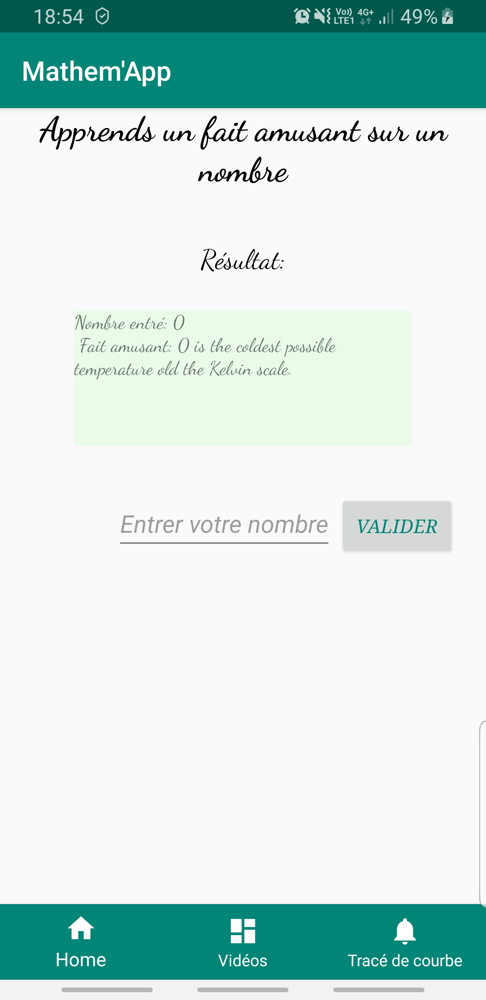

#Mathem'App
<!-- -->
_une application qui fait toucher du doigt les mathématiques_     

Cette application est constituée de **trois fragments contenus dans une activité**.

1er fragment: l'appel API REST
================================

Quand on ouvre l'application, on tombe sur le premier fragment, qui fait appel à l'API http://numbersapi.com/#42.
Le but est d'apprendre un fait amusant sur un nombre. 

D'entrée, le nombre sur lequel on apprend un fait amusant est 0, comme on peut le voir sur la capture ci-dessous:

