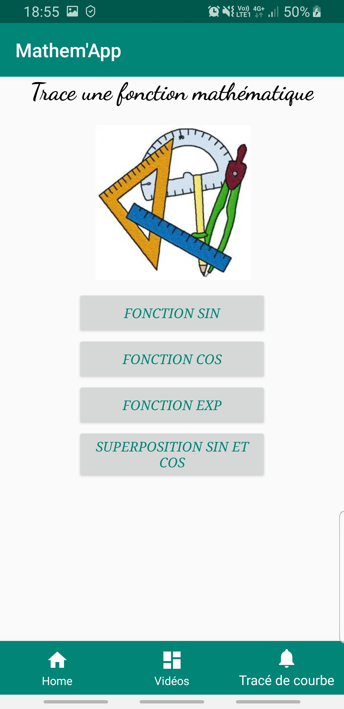
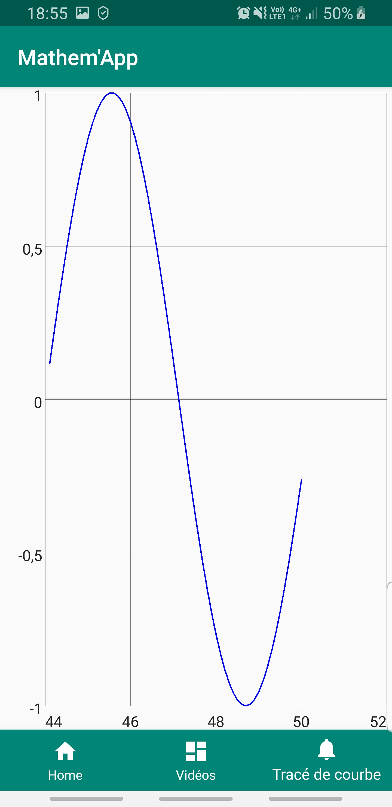
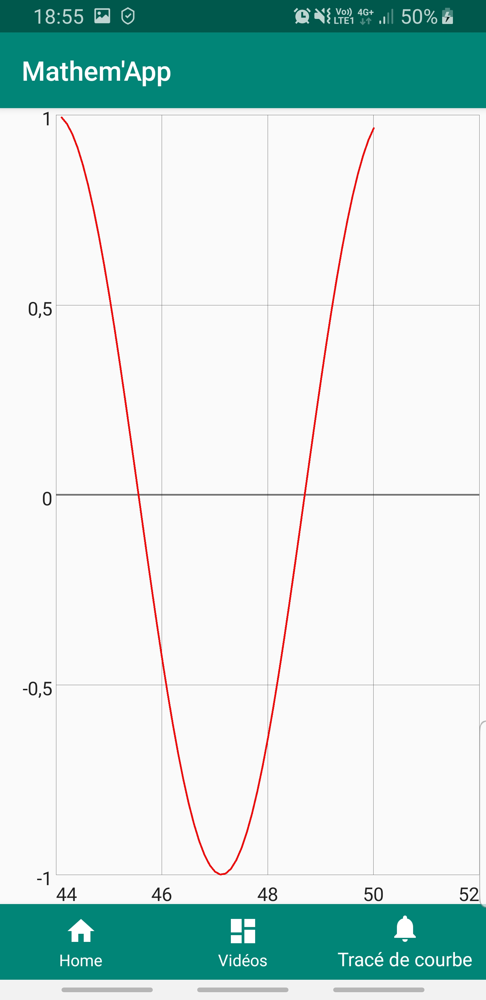
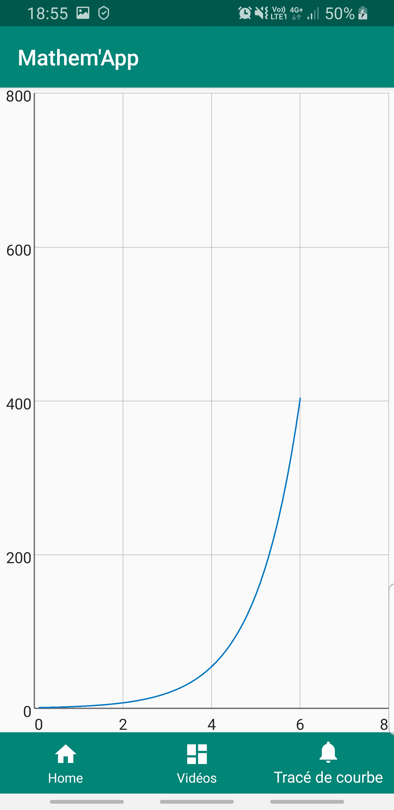
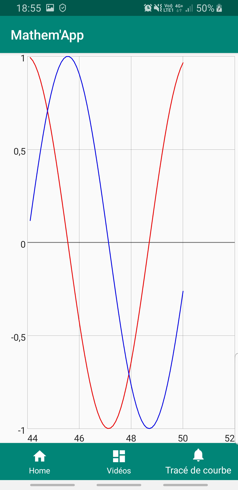

# Mathem'App
<!-- -->
_une application qui fait toucher du doigt les mathématiques_     

Cette application est constituée de **trois fragments contenus dans une activité**.
Le passage d'un fragment à l'autre se fait à l'aide de **la bottom bar**.

1er fragment: l'appel API REST
-------------------------------

Quand on ouvre l'application, on tombe sur le premier fragment, qui fait appel à l'API http://numbersapi.com/#42.
Le but est d'apprendre un fait amusant sur un nombre. 
<!-- -->
D'entrée, le nombre sur lequel on apprend un fait amusant est 0, comme on peut le voir sur la capture ci-dessous:
<!-- -->

<!-- -->
On clique ensuite sur **_Entrer votre nombre_** pour faire apparaitre le clavier. On saisit donc le nombre dont on souhaite voir les informations et on clique sur le bouton **_Valider_**
<!-- -->

<!-- -->

L'information amusante apparaît alors dans le rectangle affichant les résutats:
<!-- -->

<!-- -->

On rabat ensuite le clavier à l'aide de la touche retour de son téléphone Androïd:
<!-- -->

2ème fragment: lecteur vidéo
---------------------------------

Dans ce deuxième fragment, nous avons un lecteur de vidéo qui diffuse une vidéo issue de Youtube expliquant le sinus et le cosinus.
<!-- -->
Vous pouvez voir le rendu sur la capture ci-dessous:
<!-- -->

3ème fragment: tracer des courbes
-------------------------------------

Quand on arrive sur ce fragment, on a un menu nous permettant de visualiser les choix que nous avons pour tracer les courbes.
<!-- -->
Vous pouvez voir ce menu sur la capture ci-dessous:
<!-- -->

<!-- -->
Si on appuie sur le bouton **_FONCTION SIN_** on obtient le tracé de la fonction sinus:
<!-- -->

<!-- -->
<!-- -->
Si on appuie sur le bouton **_FONCTION COS_** on obtient le tracé de la fonction cosinus:
<!-- -->

<!-- -->
<!-- -->
Si on appuie sur le bouton **_FONCTION EXP_** on obtient le tracé de la fonction exponentielle:
<!-- -->

<!-- -->
<!-- -->
Enfin, si on appuie sur le bouton **_SUPERPOSITION SIN ET COS_** on obtient les tracés de la fonction sin et de la fonction cosinus superposés:
<!-- -->

<!-- -->
<!-- -->
Pour revenir au menu des différents tracés disponibles une fois qu'on a un tracé d'affiché, on clique sur la cloche dans la bottom bar
